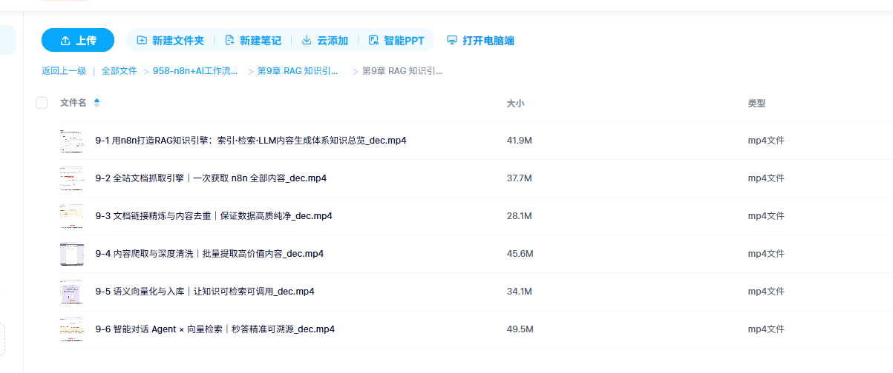

# 🧠 N8N RAG 知识引擎 — 用 RAG 打造领域专家 AI

> 基于 n8n 低代码平台，从零搭建一个 **RAG（检索增强生成）** 知识库聊天机器人。  
> 以 n8n 官方文档（1000+ 页）为数据源，构建一个"只说真话、绝不编造"的 AI 文档专家。



## 📋 项目概览

| 项 | 说明 |
|---|------|
| **平台** | [n8n](https://n8n.io/) — 开源低代码自动化 |
| **LLM** | Google Gemini 2.5 Flash（temperature=0，确保准确性） |
| **Embedding** | Google Gemini Embedding |
| **向量数据库** | n8n 内存向量库（In-Memory Vector Store） |
| **数据源** | n8n 官方文档全站（https://docs.n8n.io/） |
| **核心技术** | RAG（Retrieval-Augmented Generation） |

## 🏗️ 架构与工作流程

整个项目分为两大部分：**索引（Indexing）** 和 **聊天（Chat）**。

### 第一部分：构建知识库（索引管道）

```
手动触发
  │
  ▼
① 抓取 n8n 文档主页 ─→ 提取全部链接
  │
  ▼
② 链接去重 + 过滤 ─→ 只保留有效文档路径
  │
  ▼
③ 逐页抓取 HTML ─→ 提取 <article> 正文 ─→ 清理格式
  │
  ▼
④ 内容去重（跨执行记忆）
  │
  ▼
⑤ 文本分块（Chunk Size: 1500, Overlap: 200）
  │
  ▼
⑥ Gemini Embedding 向量化
  │
  ▼
⑦ 写入 In-Memory Vector Store
```

### 第二部分：RAG 聊天机器人

```
用户提问
  │
  ▼
① Chat Trigger（公开聊天入口）
  │
  ▼
② AI Agent（策略家 + 综合器）
  │     │
  │     ├── Gemini 2.5 Flash（LLM 大脑）
  │     ├── Buffer Memory（短期对话记忆）
  │     └── Vector Store Tool（知识库检索）
  │              │
  │              ├── Gemini Query Embedding（问题向量化）
  │              └── In-Memory Vector Store（相似度搜索，Top-K=10）
  │
  ▼
③ 仅基于检索到的文档片段生成回答（绝不编造）
```

## 📂 项目结构

```
n8n-rag-knowledge-engine/
├── README.md                              # 本文件
├── workflows/
│   ├── 00-完整RAG工作流.json              # 完整版（索引 + 聊天合一）
│   ├── 01-全站文档抓取引擎.json           # 步骤拆解版
│   ├── 02-去重和处理合规链接.json
│   ├── 03-爬取与深度清洗.json
│   ├── 04-语义向量化与入库.json
│   └── 05-聊天Agent与向量查询.json
└── docs/
    └── images/
        └── workflow-overview.png          # 工作流截图
```

## 🔧 核心节点解析

### 索引阶段

| 节点 | 作用 |
|------|------|
| **HTTP Request** | 抓取 `docs.n8n.io` 主页 HTML |
| **HTML Extract** | 提取所有 `<a>` 标签的链接 |
| **Split Out** | 将链接数组拆分为逐条 item |
| **Remove Duplicates** | 链接去重 |
| **Filter** | 只保留以 `/` 结尾且非外部链接的路径 |
| **Loop (Split In Batches)** | 批量逐页处理（配合子工作流管理内存） |
| **HTML Extract (article)** | 只提取 `<article>` 正文，跳过菜单/页脚/图片 |
| **Set (Clean)** | 正则清理文本格式 |
| **Remove Duplicates (跨执行)** | 增量更新——记住已处理的页面，避免重复入库 |
| **Recursive Text Splitter** | 按 Markdown 结构分块，chunk=1500，overlap=200 |
| **Gemini Embedding** | 将文本块转为向量 |
| **In-Memory Vector Store (Insert)** | 向量入库，Memory Key 标识知识库 |

### 聊天阶段

| 节点 | 作用 |
|------|------|
| **Chat Trigger** | 公开聊天入口（支持 Public URL） |
| **AI Agent** | 核心大脑——理解问题、调用工具、生成答案 |
| **Gemini 2.5 Flash** | LLM，temperature=0 确保事实准确 |
| **Buffer Memory** | 短期对话记忆，支持追问 |
| **Vector Store (Retrieve as Tool)** | 检索 Top-10 最相关文档片段 |
| **Gemini Query Embedding** | 将用户问题转为向量，用于相似度搜索 |

## 🚀 快速开始

### 前置要求

- 自部署的 n8n 实例（Docker 或 npm）
- Google AI API Key（用于 Gemini 模型）

### 步骤

1. **导入工作流**  
   在 n8n 中选择 `Import from File`，导入 `workflows/00-完整RAG工作流.json`

2. **配置凭据**  
   打开任意 Gemini 节点 → Credential → Create New → 粘贴 Google AI API Key

3. **构建知识库**  
   点击 `Start Indexing` 节点的 "Execute workflow"  
   ⏳ 约需 15-20 分钟完成全站索引

4. **开始聊天**  
   启用工作流 → 打开 Chat Trigger → 复制 Public URL 或直接 Open Chat

### ⚠️ 注意事项

- 向量库存储在 n8n **内存**中，重启 n8n 需重新索引
- 分步版 workflow（01-05）用于学习理解，实际使用请导入 `00-完整RAG工作流.json`

## 🎯 RAG 核心概念

```
RAG = Retrieval（检索） + Augmented（增强） + Generation（生成）

传统 LLM：直接凭记忆回答 → 可能产生幻觉
RAG：先检索相关文档 → 基于真实内容回答 → 准确可靠
```

**类比理解：**
> 把 AI 想象成一个图书管理员 📚  
> - **索引** = 图书管理员阅读所有书籍，制作索引卡片（向量化）  
> - **检索** = 收到问题后，从档案柜找出最相关的卡片  
> - **生成** = 仅根据找到的卡片内容，撰写清晰的回答

## 🛠️ 技术要点

- **子工作流内存管理**：逐页处理文档时使用子工作流，n8n 在每个子工作流完成后释放内存，避免 1000+ 页文档的处理导致 OOM
- **跨执行去重**：`Remove Duplicates` 节点启用"移除以往执行中见过的 items"，支持增量更新知识库
- **严格 System Prompt**：Agent 被指令"仅使用提供的文档作答，绝不编造"，从源头防止幻觉
- **Glassmorphism 聊天 UI**：Chat Trigger 配置了自定义 CSS，实现玻璃拟态风格

## 📚 学习路径

建议按以下顺序导入并运行分步工作流，逐步理解 RAG：

1. `01-全站文档抓取引擎.json` → 理解数据获取
2. `02-去重和处理合规链接.json` → 理解数据清洗
3. `03-爬取与深度清洗.json` → 理解内容提取
4. `04-语义向量化与入库.json` → 理解 Embedding 和向量库
5. `05-聊天Agent与向量查询.json` → 理解 RAG 检索与回答
6. `00-完整RAG工作流.json` → 完整体验

## 📝 致谢

- 工作流模板原作者：Lucas Peyrin
- 课程来源：慕课网 [N8N AI 自动化实战](https://coding.imooc.com/class/958.html) 第9章

---

*如果觉得有帮助，欢迎 ⭐ Star！*
